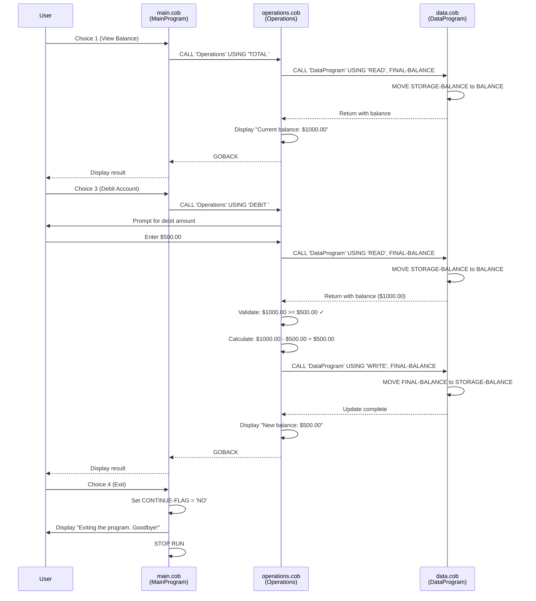
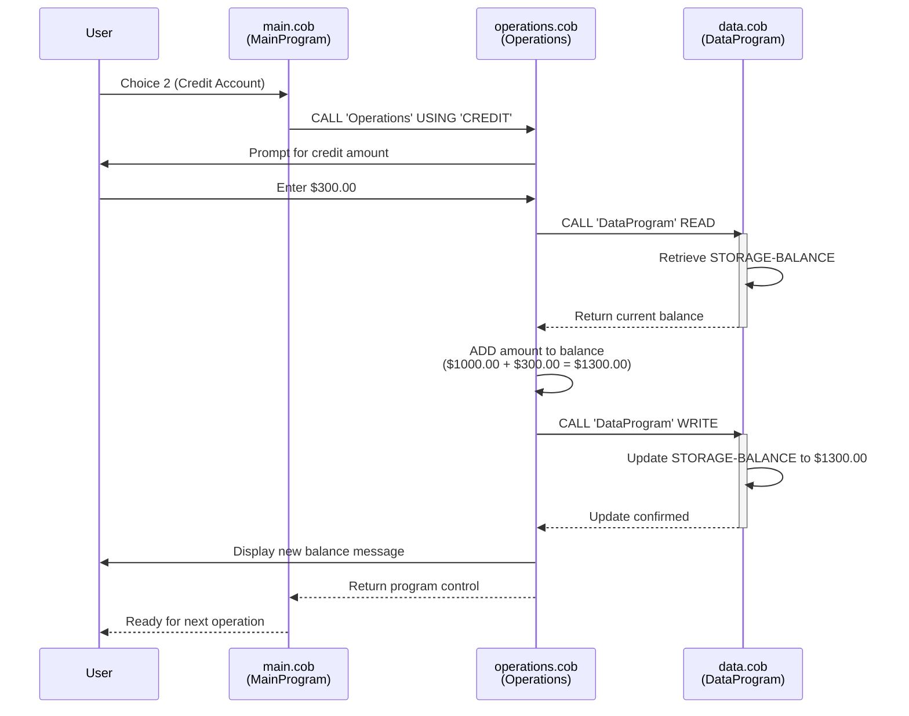
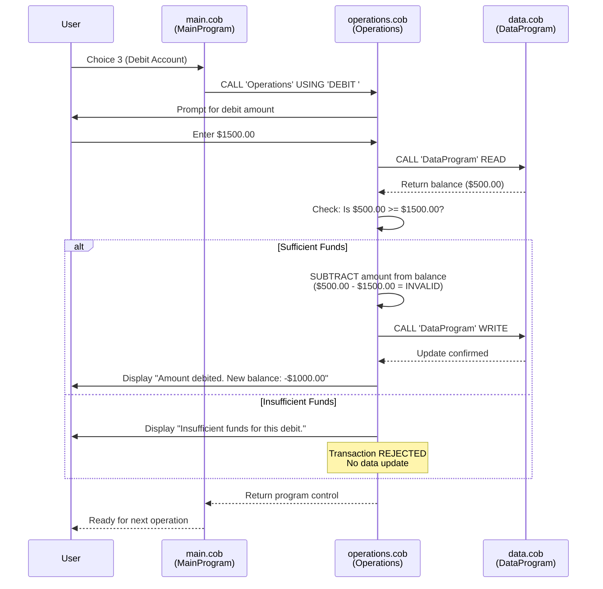

# School Accounting System - COBOL Legacy Code Documentation

## System Overview

This is a menu-driven Account Management System built in COBOL that handles student account operations for a school's accounting system. The system allows users to view account balances, credit accounts (add funds), and debit accounts (withdraw funds) with built-in validation to prevent overdrafts.

---

## Architecture

The system follows a modular architecture with three separate COBOL programs working in conjunction:

```
┌─────────────────────────────────────────┐
│     main.cob (MainProgram)              │
│  - User Interface & Menu Logic          │
└──────────┬──────────────────────────────┘
           │ CALL
           ├─────────────────────────────────────────┐
           │                                         │
    ┌──────▼─────────────────┐      ┌──────────────▼─────────┐
    │ operations.cob         │      │ data.cob                │
    │ (Operations)           │      │ (DataProgram)           │
    │ - Business Logic       │      │ - Data Storage & Access │
    │ - Transaction Handler  │      │ - Balance Management    │
    └────────────┬───────────┘      └──────────────┬──────────┘
                 │ CALL                           │
                 └───────────────────┬─────────────┘
```

---

## File Details

### 1. **main.cob** (MainProgram)
**Purpose:** Entry point and user interface layer for the account management system.

**Responsibilities:**
- Displays the main menu interface
- Accepts user input for menu selection
- Routes user requests to the appropriate operation handler
- Manages program flow and exit conditions

**Key Variables:**
| Variable | Type | Purpose |
|----------|------|---------|
| USER-CHOICE | Numeric | Stores user's menu selection (1-4) |
| CONTINUE-FLAG | Alphanumeric | Controls loop continuation ('YES'/'NO') |

**Key Functions:**
- **MAIN-LOGIC:** Core loop that displays menu and processes user choices:
  - Option 1: View Balance → Calls Operations with 'TOTAL '
  - Option 2: Credit Account → Calls Operations with 'CREDIT'
  - Option 3: Debit Account → Calls Operations with 'DEBIT '
  - Option 4: Exit → Terminates program

**Business Rules:**
- Provides a user-friendly menu interface with clear options
- Validates user input range (1-4)
- Graceful exit handling with confirmation message

---

### 2. **data.cob** (DataProgram)
**Purpose:** Data layer that manages persistent account balance storage and retrieval.

**Responsibilities:**
- Maintains the student account balance in memory
- Handles read operations for balance retrieval
- Handles write operations for balance updates
- Acts as a data abstraction layer between business logic and storage

**Key Variables:**
| Variable | Type | Purpose |
|----------|------|---------|
| STORAGE-BALANCE | Numeric (6,2) | Persistent account balance (initial: 1000.00) |
| OPERATION-TYPE | Alphanumeric | Operation to perform ('READ' or 'WRITE') |
| PASSED-OPERATION | Alphanumeric | Linkage parameter for operation type |
| BALANCE | Numeric (6,2) | Linkage parameter for balance value |

**Key Functions:**
- **READ Operation:** Retrieves current account balance from STORAGE-BALANCE
- **WRITE Operation:** Updates STORAGE-BALANCE with new balance value

**Business Rules:**
- Initial account balance is $1,000.00
- Supports up to 999,999.99 balance (6 digits with 2 decimal places)
- Acts as the single source of truth for balance information
- All balance modifications must pass through this module

---

### 3. **operations.cob** (Operations)
**Purpose:** Business logic layer implementing account transaction operations.

**Responsibilities:**
- Processes account inquiries (balance queries)
- Handles credit transactions (deposits)
- Handles debit transactions (withdrawals)
- Validates transaction eligibility (overdraft prevention)

**Key Variables:**
| Variable | Type | Purpose |
|----------|------|---------|
| OPERATION-TYPE | Alphanumeric | Type of operation to perform |
| AMOUNT | Numeric (6,2) | Transaction amount entered by user |
| FINAL-BALANCE | Numeric (6,2) | Current or updated account balance |
| PASSED-OPERATION | Alphanumeric | Linkage parameter from calling program |

**Key Functions:**

#### **TOTAL Operation** (View Balance)
- **Action:** Displays current account balance
- **Process:**
  1. Calls DataProgram with 'READ' operation
  2. Retrieves current balance
  3. Displays "Current balance: [amount]"
- **No validation required**

#### **CREDIT Operation** (Add Funds)
- **Action:** Adds specified amount to account balance
- **Process:**
  1. Prompts user to enter credit amount
  2. Calls DataProgram with 'READ' to get current balance
  3. Adds amount to balance
  4. Calls DataProgram with 'WRITE' to update balance
  5. Displays new balance confirmation
- **Validation:** None (allows unlimited deposits)
- **Business Rule:** All credit operations succeed unconditionally

#### **DEBIT Operation** (Withdraw Funds)
- **Action:** Removes specified amount from account balance
- **Process:**
  1. Prompts user to enter debit amount
  2. Calls DataProgram with 'READ' to get current balance
  3. Validates sufficient funds available
  4. If valid:
     - Subtracts amount from balance
     - Calls DataProgram with 'WRITE' to update balance
     - Displays new balance confirmation
  5. If insufficient funds:
     - Displays error message
     - Transaction is rejected
- **Validation:** Balance must be >= withdrawal amount
- **Business Rule:** Prevents overdrafts and negative balances

**Business Rules:**
- All transactions follow a read-modify-write pattern
- Only debit operations have overdraft protection
- Credit operations are unrestricted
- Balance queries do not modify state

---

## Data Flow

### Credit Transaction Example
```
User Input: 500.00
    ↓
MainProgram (receives choice 2)
    ↓
Operations (CREDIT operation)
    ├─ Accepts amount: 500.00
    ├─ Calls DataProgram READ → Gets 1000.00
    ├─ Calculates: 1000.00 + 500.00 = 1500.00
    ├─ Calls DataProgram WRITE → Updates balance
    └─ Displays: "New balance: 1500.00"
```

### Debit Transaction Example (with validation)
```
User Input: 800.00
    ↓
MainProgram (receives choice 3)
    ↓
Operations (DEBIT operation)
    ├─ Accepts amount: 800.00
    ├─ Calls DataProgram READ → Gets 1000.00
    ├─ Validates: 1000.00 >= 800.00 ✓
    ├─ Calculates: 1000.00 - 800.00 = 200.00
    ├─ Calls DataProgram WRITE → Updates balance
    └─ Displays: "New balance: 200.00"

Overdraft Attempt: 1200.00
    ├─ Validates: 200.00 >= 1200.00 ✗
    └─ Displays: "Insufficient funds for this debit."
```

---

## Technical Specifications

### Numeric Precision
- **Balance Format:** PIC 9(6)V99
  - 6 digits before decimal point
  - 2 digits after decimal point
  - Maximum value: 999,999.99
  - Minimum value: 0.00

### Program Communication
- **Method:** COBOL CALL statement with USING clause
- **Parameters:** Passed by value using LINKAGE SECTION
- **Return Method:** GOBACK statement

### Data Storage
- **Current Implementation:** In-memory storage (COBOL WORKING-STORAGE)
- **Scope:** Single program execution session
- **Persistence:** Not persistent across program invocations (data reset on restart)

---

## Key Business Rules Summary

| Rule | Module | Impact |
|------|--------|--------|
| Initial balance of $1,000.00 | DataProgram | All new accounts start with this balance |
| Overdraft Prevention | Operations (DEBIT) | Withdrawal denied if balance insufficient |
| Unrestricted Credits | Operations (CREDIT) | No maximum limit on deposits |
| Two Decimal Places | All | All monetary amounts support cents |
| Single Account Context | DataProgram | System manages one account per session |

---

## Modernization Opportunities

1. **Persistent Storage:** Replace in-memory STORAGE-BALANCE with database (SQL/NoSQL)
2. **Multi-Account Support:** Extend to handle multiple student accounts
3. **Transaction History:** Maintain audit logs of all transactions
4. **Enhanced Validation:** Add date-based restrictions, spending limits, flags
5. **Security:** Implement authentication and authorization
6. **API Layer:** Create REST/GraphQL endpoints for modern client integration
7. **Error Handling:** Implement comprehensive exception handling
8. **Concurrency:** Add support for simultaneous transactions
9. **Reporting:** Generate statements and transaction summaries
10. **Decimal Handling:** Replace COBOL decimals with currency data types

---

## Sequence Diagrams

### Complete Application Flow Diagram

Shows the interaction between all system components for a typical user session including balance inquiry and a debit transaction:



### Credit Transaction Flow Diagram

Detailed sequence for crediting an account (adding funds):



### Debit with Overdraft Protection Flow Diagram

Detailed sequence showing overdraft validation on debit request:



---

## Related Files

- **License:** See [LICENSE](../LICENSE)
- **Main README:** See [README.md](../README.md)
- **Source Code:**
  - [src/cobol/main.cob](../src/cobol/main.cob)
  - [src/cobol/data.cob](../src/cobol/data.cob)
  - [src/cobol/operations.cob](../src/cobol/operations.cob)
